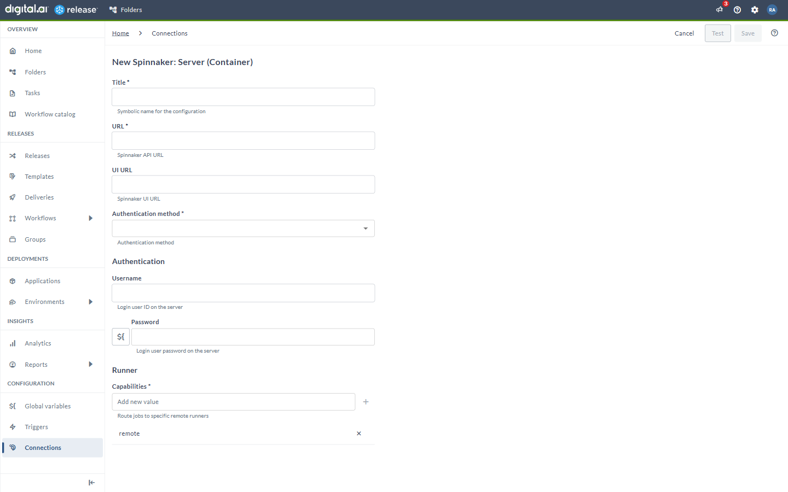
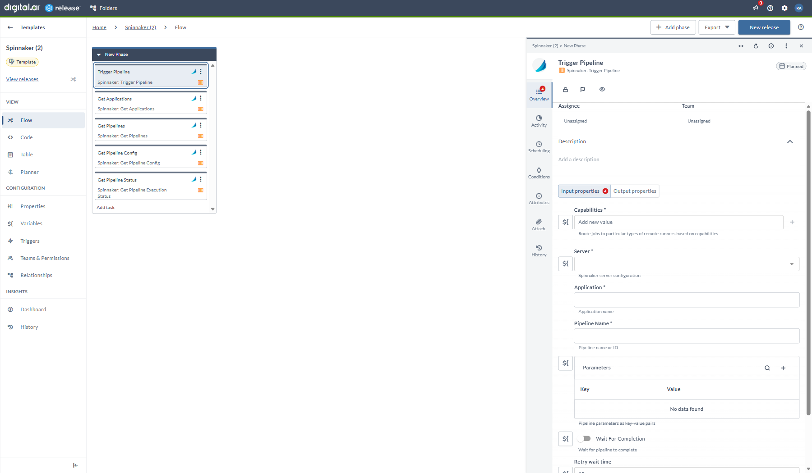
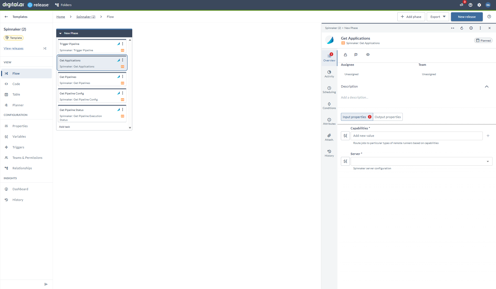
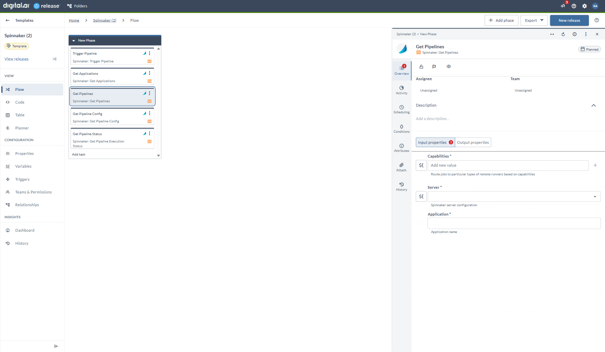
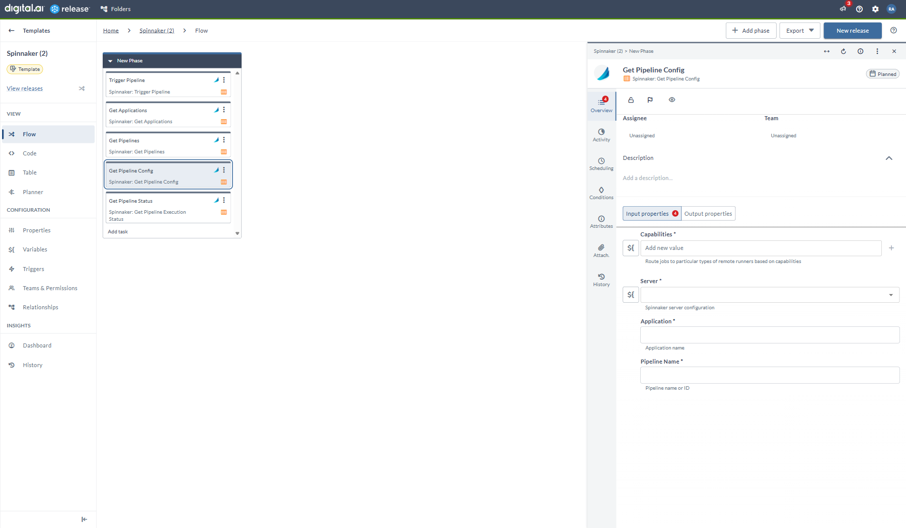
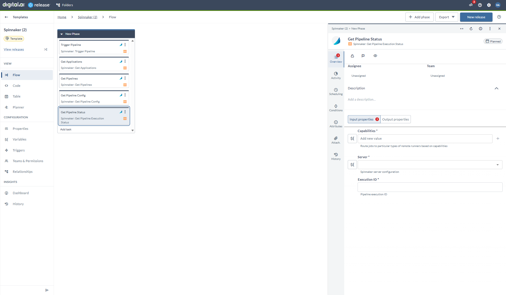

# Manage your Pipelines using Spinnaker

### Before you begin
This how-to involves working with a variety of tools, such as Digital.ai Release and Spinnaker. You can perform this task by following the instructions. However, being familiar with these tools and technologies can significantly help you when you try them out in your test environment.

### What's the objective?
The objective is to interact with Spinnaker pipelines from Digital.ai Release to trigger deployments, inspect pipeline configurations, and monitor execution status as part of your automated release process.

### What do you need?
* A Linux or Windows server (with root and Internet access) that has Digital.ai Release version 24.1.0 (or later) installed
* Remote runner setup for Digital.ai Release
* Spinnaker integration for Digital.ai Release

### What do you have?
* A running Spinnaker instance with Gate API accessible
* Spinnaker credentials

### How does it work?
The Spinnaker integration connects Digital.ai Release to Spinnaker's Gate API, allowing you to trigger pipelines, retrieve application and pipeline information, and monitor pipeline execution status from your release flows.

## Set up Spinnaker Configuration

1. From the navigation pane, under **CONFIGURATION**, click **Connections**.
2. Under **HTTP Server connections**, next to **Spinnaker: Server (Container)**, click the add button.
   The **New Spinnaker: Server (Container)** page opens.
3. In the **Title** field, enter the name of the configuration.
   This name will display in Spinnaker tasks.
4. In the **URL** field, enter the URL of the Spinnaker Gate API server (for example, `http://spin-gate:8084`).
5. In the **UI URL** field, enter the URL of the Spinnaker UI (for example, `http://spinnaker.example.com`).
6. Select the **Authentication method** to use when connecting to Spinnaker:
   * **Basic** — username and password authentication
7. If you selected **Basic** authentication, enter the **Username** and **Password** for your Spinnaker account.
8. To test the connection, click **Test**.
9. To save the configuration, click **Save**.

## Trigger Pipeline (Container)

The _Trigger Pipeline (Container)_ task triggers a Spinnaker pipeline for a given application and optionally waits for the pipeline execution to complete.

1. In the release flow tab of a Release template, add a task of type **Spinnaker** > **Trigger Pipeline (Container)**.
2. Click the added task to open it.
3. In the **Capabilities** field, enter a value that matches the capability set for your remote runner.
   This will help you to route jobs to that particular remote runner.
4. In the **Server** field, select the Spinnaker server configuration.
5. In the **Application** field, enter the name of the Spinnaker application.
6. In the **Pipeline Name** field, enter the name of the Spinnaker pipeline to trigger.
7. In the **Parameters** field, provide any key-value pairs to pass as pipeline parameters.
8. Switch on the **Wait For Completion** toggle if you want the task to wait until the pipeline execution finishes.
9. In the **Retry Wait Time** field, enter the number of seconds to wait between status check retries (default: 15).
10. In the **Max Retries** field, enter the maximum number of status check retries (default: 5).

**Output properties:**
* **execution** — the Spinnaker pipeline execution ID
* **executionStatus** — the final status of the pipeline execution

## Get Applications (Container)

The _Get Applications (Container)_ task retrieves the list of all applications registered in Spinnaker.

1. In the release flow tab of a Release template, add a task of type **Spinnaker** > **Get Applications (Container)**.
2. Click the added task to open it.
3. In the **Capabilities** field, enter a value that matches the capability set for your remote runner.
   This will help you to route jobs to that particular remote runner.
4. In the **Server** field, select the Spinnaker server configuration.

**Output properties:**
* **applications** — the list of Spinnaker application names

## Get Pipelines (Container)

The _Get Pipelines (Container)_ task retrieves all pipeline definitions for a given Spinnaker application.

1. In the release flow tab of a Release template, add a task of type **Spinnaker** > **Get Pipelines (Container)**.
2. Click the added task to open it.
3. In the **Capabilities** field, enter a value that matches the capability set for your remote runner.
   This will help you to route jobs to that particular remote runner.
4. In the **Server** field, select the Spinnaker server configuration.
5. In the **Application** field, enter the name of the Spinnaker application whose pipelines you want to retrieve.

**Output properties:**
* **pipelines** — the list of pipeline names for the specified application

## Get Pipeline Config (Container)

The _Get Pipeline Config (Container)_ task retrieves the full configuration of a specific Spinnaker pipeline.

1. In the release flow tab of a Release template, add a task of type **Spinnaker** > **Get Pipeline Config (Container)**.
2. Click the added task to open it.
3. In the **Capabilities** field, enter a value that matches the capability set for your remote runner.
   This will help you to route jobs to that particular remote runner.
4. In the **Server** field, select the Spinnaker server configuration.
5. In the **Application** field, enter the name of the Spinnaker application.
6. In the **Pipeline Name** field, enter the name of the pipeline whose configuration you want to retrieve.

**Output properties:**
* **configuration** — the pipeline configuration as a JSON

## Get Pipeline Status (Container)

The _Get Pipeline Status (Container)_ task retrieves the current execution status of a running or completed Spinnaker pipeline.

1. In the release flow tab of a Release template, add a task of type **Spinnaker** > **Get Pipeline Status (Container)**.
2. Click the added task to open it.
3. In the **Capabilities** field, enter a value that matches the capability set for your remote runner.
   This will help you to route jobs to that particular remote runner.
4. In the **Server** field, select the Spinnaker server configuration.
5. In the **Execution Id** field, enter the Spinnaker pipeline execution ID to check. You can reference the output of a **Trigger Pipeline** task here.

**Output properties:**
* **executionStatus** — the current status of the pipeline execution (for example, `RUNNING`, `SUCCEEDED`, `FAILED`)

